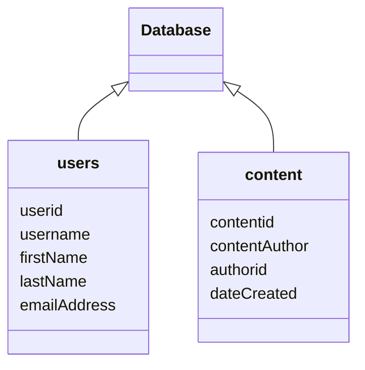

# intro

## review
- [linux commmands](linux-lesson.md)

## learning objectives

- learn SQL basics
    - databases
    - queries
- basic SQL injection
    - most basic example
        - string escaping
        - logic
        - comments 
- `sqlmap`
    - automated SQL exploitation tool

## SQL basics - what is SQL
- structured query language
- used for databases
    - databases are the 'back end' of web, phone applications
    - database stores user account info: user id, username, password, other info
- impractical to manually inspect millions of records; need some way to quickly
  grab info
- information is retrieved from database with *queries*. this is like asking the database questions:
        - who is the user with user id 1?
        - how many users interacted with the video with video id
          b1946ac92492d2347c6235b4d2611184?


## basic SQL injection
```sql
sql(database)> SELECT <columns> FROM <table> WHERE user_id = '$id';
```
- `sql(database)>` : this is the prompt.  we are currently working in the
  database named `database`
- `SELECT <columns>` : select the information we're interested from each
  condition
