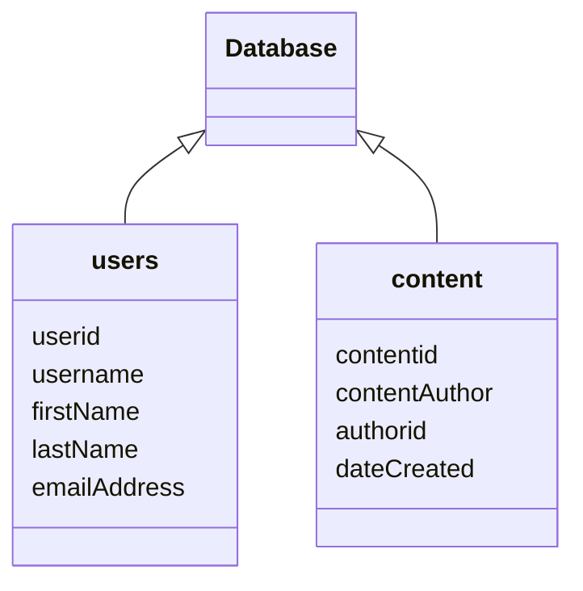

# intro

## review
- [linux commmands](linux-lesson.md)

## learning objectives

- learn SQL basics
    - databases
    - queries
- basic SQL injection
    - most basic example
        - string escaping
        - logic
        - comments 
- `sqlmap`
    - automated SQL exploitation tool

# SQL basics - what is SQL
- structured query language
- used for databases
    - databases are the 'back end' of web, phone applications
    - database stores user account info: user id, username, password, other info
- impractical to manually inspect millions of records; need some way to quickly
  grab info
- information is retrieved from database with *queries*. this is like asking the database questions:
        - who is the user with user id 1?
        - how many users interacted with the video with video id
          b1946ac92492d2347c6235b4d2611184?

## hands on practice 1 - sql familiarization (~15 minutes)

follow [this link](https://www.sqlcourse.com/beginner-course/selecting-data) to
get some hands-on practice with SQL queries.  Take about fifteen minutes to
read this page, and then attempt the questions at the end.


# SQL query structure

```sql
sql(database)> SELECT <columns> FROM <table> WHERE <condition>;
```

- `sql(database)>` : this is the prompt.  we are currently working in the
  database named `database`
- `SELECT <columns>` : select the information we're interested from each
  listed column
- `FROM <table>` : the table from the database containing the data we're
  interested in
- `WHERE <condition>` : refinement - see below

### `WHERE <condition>`

- queries may return lots of information that we're not necessarily interested
  in
- use `WHERE` to further refine information returned
- `<condition>` is an expression which evaluates to either *true* or *false*
  (boolean)


## putting it together - basic SQL injection
- "injection": altering user input to get the target machine to do something
  other than the intended behavior

### basic SQL query
```sql
sql(dvwa)> SELECT first_name, last_name FROM users WHERE user_id = '$id';
```
- `$id` is user input - is this injectible?

### basic injection example
- hinges on the `WHERE user_id = '$id'` part of the query
- `'$id`' is a variable that will contain user-supplied information.
- user can put in 'bad data' that alters the SQL query


```sql
#original
sql(dvwa)> SELECT first_name, last_name FROM users WHERE user_id = '$id';

#injected
sql(dvwa)> SELECT first_name, last_name FROM users WHERE user_id = '$id' or '1=1'-- -;
```

- `or '1=1'-- -`: user-supplied 'bad' data
    - `or '1=1'`a conditional which always evaluates to `true`
    - `-- -`: an SQL comment - ignore everything that follows

- injection: user-supplied bad data
    - `' or '1=1'-- -`

### boolean expressions - truth table

```
| p | q | p AND q | p OR q | p AND p |
|:-:|:-:|:-------:|:------:|:-------:|
| f | f |    f    |    f   |    f    |
| f | t |    f    |    t   |    f    |
| t | f |    f    |    t   |    t    |
| t | t |    t    |    t   |    t    |
```

## hands-on practice 2 - sql injection (~15 min)

### setup
1. follow the [wifi instructions](wifi-instructions.md) to get connected to the
   lab
2. navigate to [dvwa](link) - login info is `admin:password`.
3. navigate to the 'SQL Injection' page

### exercise
1. enter the user id `1` in the form.  what comes back?
2. try different user IDs.  how many users are there in the database?
3. now try the form with `' or '1=1'-- -`.  what comes back?
4. what are some ways we could use this information?

# `sqlmap`

`sqlmap` is a command-prompt tool used to automatically enumerate and dump
information from vulnerable databases.  by the end of this lesson, you will
have used this tool to dump the database to your kali machine. this is the
general structure of the command we'll use

```bash
sqlmap -u "<url of injectible page>" --cookie="<cookie info>" -D <database> --dump
```
- `-u "<url of injectible page>"` the location of the injectible page
- `--cookie="<cookie info>"` necessary cookies required by the web app
- `-D <database>` the name of the database we're interested in
- `--dump` get all the records

